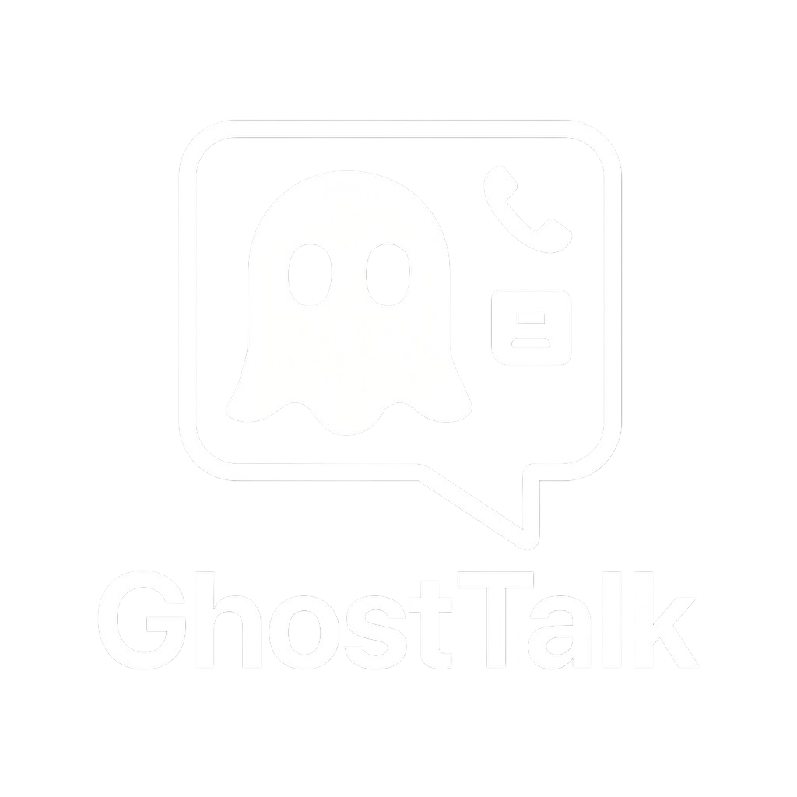
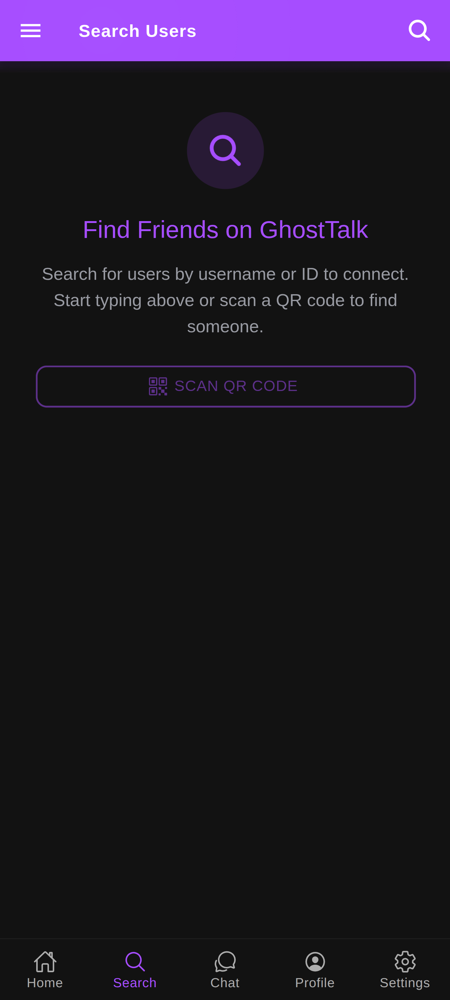
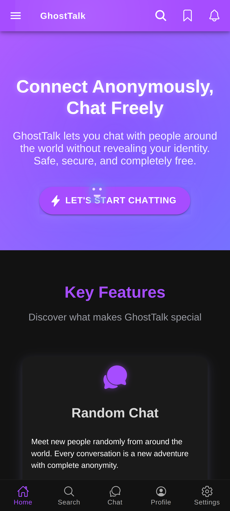
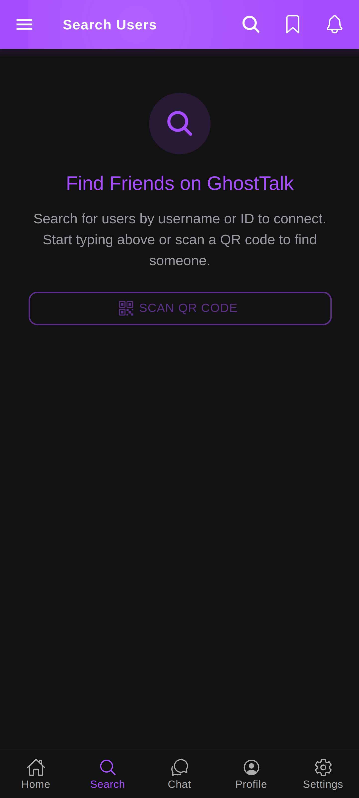
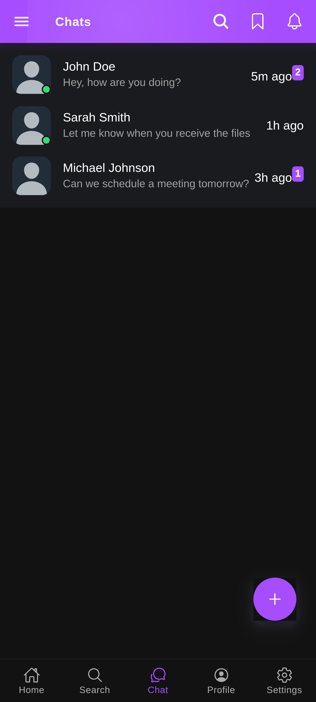
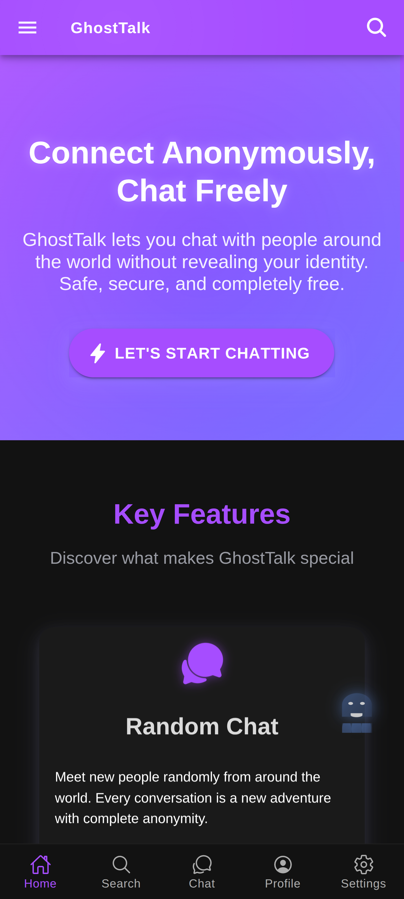
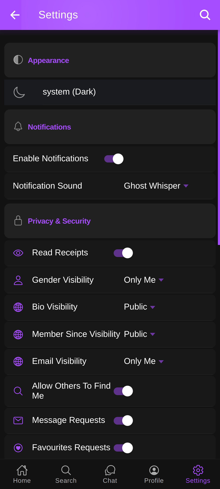
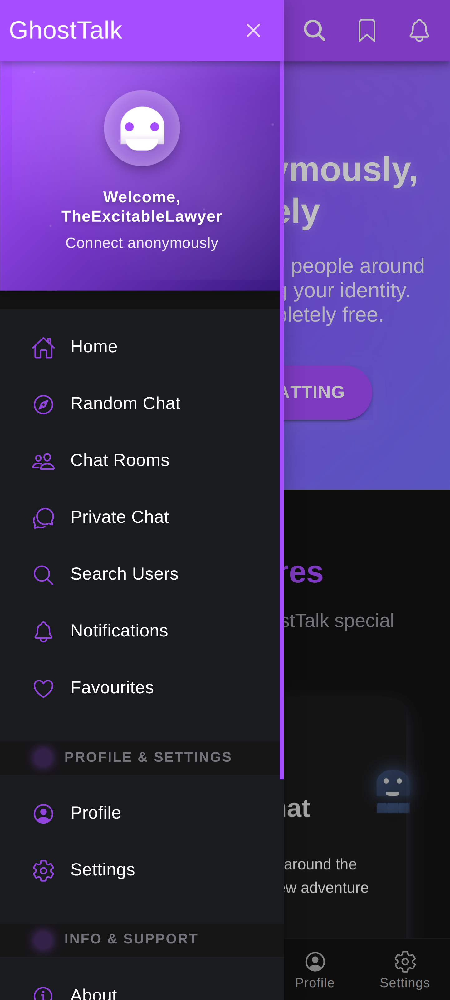
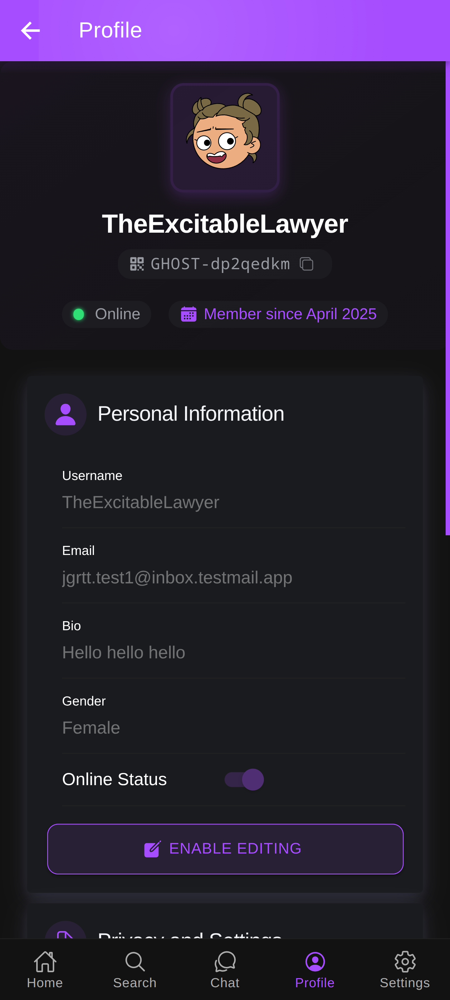

# GhostTalk

<div align="center">
  
  <h3>Privacy-First Anonymous Messaging</h3>
  
  
  
  
  
  
</div>

<p align="center">
  <a href="#-about">About</a> •
  <a href="#-features">Features</a> •
  <a href="#-demo">Demo</a> •
  <a href="#-installation">Installation</a> •
  <a href="#-tech-stack">Tech Stack</a> •
  <a href="#-contact">Contact</a>
</p>

## � About

GhostTalk is a privacy-focused messaging platform built for secure, anonymous communication. Started in 2025, our mission is to provide a digital space where conversations remain truly private—not stored in corporate databases, not analyzed for advertising, and not vulnerable to breaches.

**Key Principles:**
- **Zero-Knowledge Architecture**: We can't access your messages
- **No Personal Data Required**: Register without phone numbers or emails  
- **End-to-End Encryption**: Military-grade security for all communications
- **Open-Source Core**: Transparency in our security implementation

## ✨ Features

- **🔮 Ghost Messages** - Self-destructing messages that disappear after reading
- **🔒 End-to-End Encryption** - Military-grade AES-256 encryption
- **🕶️ Anonymous Profiles** - No phone number or email required
- **👥 Secure Chat Rooms** - Topic-based discussions with privacy controls
- **� Cross-Platform** - Available on iOS, Android, and Web
- **🚫 Anti-Screenshot Protection** - Alerts when screenshots are taken
- **📂 Secure File Transfer** - Encrypted file sharing up to 100MB
- **🎭 Disappearing Media** - Photos and videos that vanish after viewing

## � Demo

<div align="center">
  <table>
    <tr>
      <td></td>
      <td></td>
      <td></td>
      <td></td>
    </tr>
    <tr>
      <td></td>
      <td></td>
      <td></td>
      <td></td>
    </tr>
  </table>
</div>

**📹 Demo Video:** *Coming Soon*

## 🚀 Installation

### Prerequisites
- Node.js 16+ and Python 3.8+
- Git for version control

### Quick Start

```bash
# Clone the repository
git clone https://github.com/Lusan-sapkota/GhostTalk.git
cd GhostTalk

# Backend setup
cd Backend
python -m venv venv
source venv/bin/activate  # Windows: venv\Scripts\activate
pip install -r requirements.txt
python run.py

# Frontend setup (new terminal)
cd Frontend
npm install
npm run dev
```

Access the app at `http://localhost:8100`

## 🛠️ Tech Stack

### Frontend
- **Ionic Framework** - Cross-platform UI toolkit
- **React** - JavaScript library for building UIs
- **TypeScript** - Strongly typed programming language
- **Capacitor** - Native bridge for cross-platform apps

### Backend
- **Python Flask** - Lightweight web framework
- **Appwrite** - Backend as a Service
- **WebSockets** - Real-time messaging
- **AES-256** - Advanced encryption standard

### Security
- **End-to-End Encryption** - AES-256 bit encryption
- **Perfect Forward Secrecy** - Session keys protection
- **Zero-Knowledge Architecture** - Minimal data collection

## 📞 Contact

**Developer:** Lusan Sapkota  
**Website:** [lusansapkota.com.np](https://lusansapkota.com.np)  
**Issues:** [GitHub Issues](https://github.com/Lusan-sapkota/GhostTalk/issues)

---

<div align="center">
  
  <h3>GhostTalk - Privacy-First Messaging</h3>
  <p><em>Started 2025 • Active Development</em></p>
  
  
  
  
  © 2025 GhostTalk. All rights reserved.
</div>